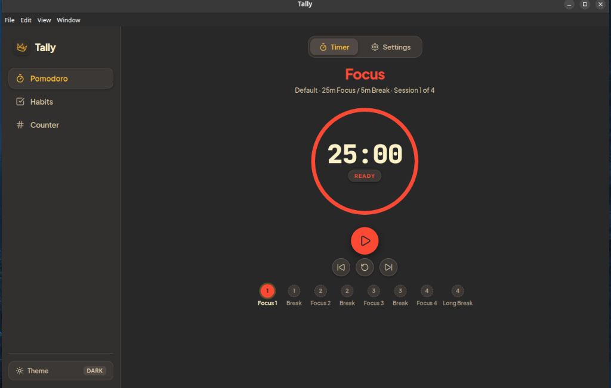
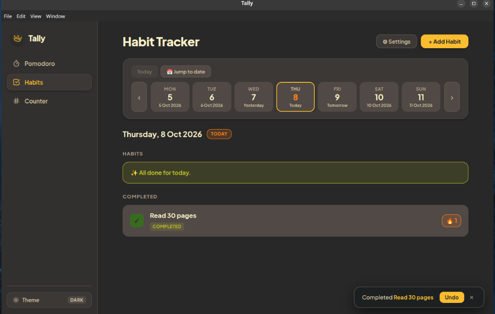
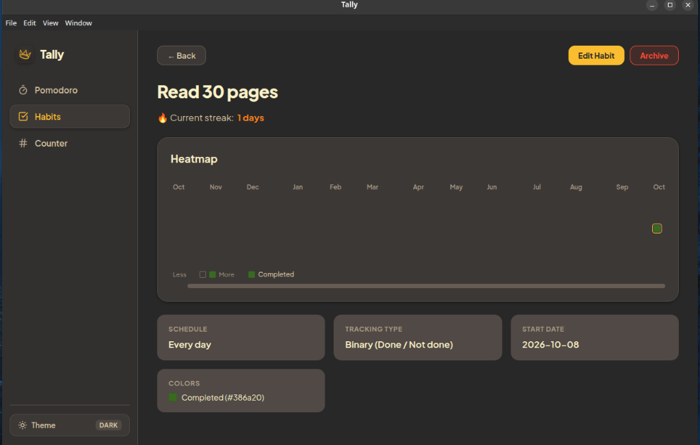
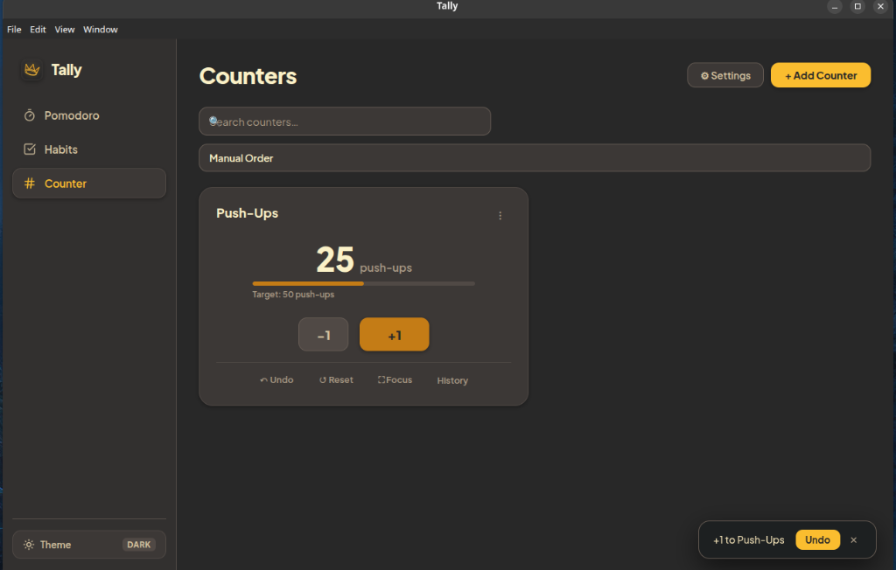

# Tally

> [!NOTE]
> ### this is a fully vibe coded app because i don't have time to build it myself

---

<div align="center">

  
  <br />
  <br />

  **A minimalist, distraction-free productivity dashboard for desktop.**  
  Featuring a circular Pomodoro timer, multi-view habit tracker with calendar heatmaps, and customizable tally counters — styled in authentic **Gruvbox Medium Contrast** (Dark & Light).

</div>

---

## 📸 Screenshots

<div align="center">
  <table>
    <tr>
      <td width="50%" align="center">
        <b>🍅 Pomodoro Timer</b><br />
        
      </td>
      <td width="50%" align="center">
        <b>📅 Habit Tracker</b><br />
        
      </td>
    </tr>
    <tr>
      <td width="50%" align="center">
        <b>🔥 Habit Heatmap & Streaks</b><br />
        
      </td>
      <td width="50%" align="center">
        <b>🔢 Tally Counters</b><br />
        
      </td>
    </tr>
  </table>
</div>

---

## ✨ Features

- 🍅 **Pomodoro Timer**: Circular animated progress ring, customizable intervals (Focus, Short Break, Long Break), single-cycle long break logic, and dynamic multi-session timeline.
- 📅 **Habit Tracker**: Track daily habits, view monthly progress with color heatmaps, monitor streaks, and organize by categories.
- 🔢 **Tally Counters**: Fast keyboard/click tally counting, custom step increments, goals, reset points, and sorting.
- 🎨 **Gruvbox Medium Contrast Theme**: Carefully crafted palette with seamless dark and warm light mode toggle.
- 💾 **Reliable Local Persistence**: Powered by `electron-store` with atomic disk writes — 100% offline and private.

---

## 📦 Download & Installation

Visit the [GitHub Releases](https://github.com/) page to download the latest prebuilt binaries for your operating system.

### 🐧 Linux (All Distributions)

Tally is packaged for all major Linux distributions:

#### 1. Universal AppImage (Recommended for any Linux distro)
Works on Ubuntu, Fedora, Arch Linux, Debian, openSUSE, Linux Mint, Pop!_OS, Manjaro, and more.
```bash
# 1. Make executable:
chmod +x Tally-*.AppImage

# 2. Run:
./Tally-*.AppImage

# If your distro uses AppArmor restrictions (e.g. Ubuntu 24.04):
./Tally-*.AppImage --no-sandbox
```
> **Note on Ubuntu 22.04+ / Debian 12**: If you see `dlopen(): error loading libfuse.so.2`, install the FUSE 2 compatibility library:
> ```bash
> sudo apt install libfuse2
> ```
> Alternatively, run without installing FUSE:
> ```bash
> ./Tally-*.AppImage --appimage-extract-and-run --no-sandbox
> ```

#### 2. Debian, Ubuntu, Linux Mint, Pop!_OS (`.deb`)
```bash
# Install via apt (automatically resolves dependencies):
sudo apt install ./tally_*_amd64.deb

# Or via dpkg:
sudo dpkg -i tally_*_amd64.deb
sudo apt-get install -f
```

#### 3. Fedora, RHEL, openSUSE (`.rpm`)
```bash
# Install via dnf:
sudo dnf install ./tally-*.x86_64.rpm

# Or via rpm:
sudo rpm -i tally-*.x86_64.rpm
```

#### 4. Arch Linux & Generic Linux Tarball (`.tar.gz`)
```bash
tar -xzf tally-*.tar.gz
cd tally-*
./tally
```

---

### 🪟 Windows (10 / 11)

- **Installer (`Tally-Setup-x.x.x.exe`)**:
  Standard installer that configures desktop and start menu shortcuts and registers uninstaller.
  Simply double-click to install.

- **Portable (`Tally-Portable-x.x.x.exe`)**:
  Zero-installation portable executable. Keep it on a USB stick or any local folder and run directly.

> *Note for Windows Defender SmartScreen*: Because this binary is open-source and self-built without a paid Microsoft Code Signing Certificate, click **"More info" → "Run anyway"** if prompted.

---

### 🍎 macOS (Apple Silicon & Intel)

- **DMG Image (`Tally-x.x.x.dmg` / `universal.dmg`)**:
  1. Open the `.dmg` file.
  2. Drag **Tally** into your **Applications** folder.

- **ZIP Archive (`Tally-x.x.x-mac.zip`)**:
  1. Extract the `.zip` archive.
  2. Move `Tally.app` to `/Applications`.

> *Note for macOS Gatekeeper*: If macOS displays a notice stating the app can't be opened because Apple cannot check it for malicious software:
> 1. Right-click (or Control-click) `Tally.app` in `/Applications` and select **Open**.
> 2. Or run this command in Terminal:
> ```bash
> xattr -cr /Applications/Tally.app
> ```

---

## 🛠️ Building From Source

If you prefer building Tally locally on your machine:

### Prerequisites
- [Node.js](https://nodejs.org/) (version 20 or higher)
- [pnpm](https://pnpm.io/) (version 9 or higher)

### Setup & Development
```bash
# Clone the repository
git clone https://github.com/your-username/tally.git
cd tally

# Install dependencies
pnpm install

# Start local development mode (hot-reloading enabled)
pnpm dev

# Run automated tests
pnpm test

# Typecheck code
pnpm typecheck
```

### Packaging Binaries Locally
```bash
# Compile TypeScript & bundle renderer
pnpm build

# Package for current platform
pnpm package

# Or package specifically for a target:
pnpm package:linux   # Generates .AppImage, .deb, .rpm in release/
pnpm package:win     # Generates .exe installer & portable .exe in release/
pnpm package:mac     # Generates .dmg & .zip in release/
```

All packaged installers will be generated inside the `release/` directory.


